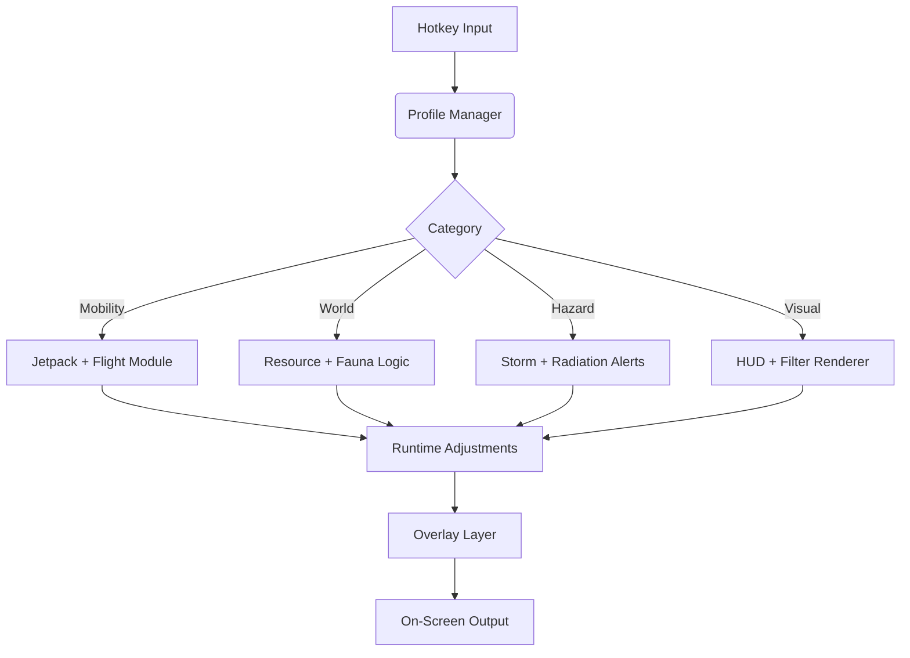

## 🌠 Overview

No Man’s Sky is a vast, shifting ocean of worlds, anomalies, fauna, storms, ruins, and starships.
This mod menu grants **real-time control** over visibility, exploration flow, UI clarity, mobility feel, and environmental awareness—
not to break immersion, but to *enhance* it.

With it, you can tailor:

* flight handling
* jetpack & traversal flow
* resource visibility
* hazard & weather clarity
* fauna/flora scanning ease
* exploration routing
* performance-friendly overlays
* minimalist or cinematic HUD profiles

It’s your galaxy—
the menu simply gives you better tools to read it.


---

## 🚀 Feature Suite

### ⭐ Traversal, Jetpack & Flight Controls

* **Jetpack Flow Curves**
  Smooth vertical drift and soften horizontal sway.
* **Flight Handling Sculptor**
  Adjust roll stability, braking curve, and atmospheric steering.
* **Terrain Sprint Smoother**
  Prevents abrupt slowdown across uneven landscapes.

### 🌡 Hazard & Survival Awareness

* **Environmental Hazard Radar**
  Alerts for radiation, toxins, heat storms, cold snaps.
* **Storm Shelter Indicator**
  Outlines safe caves or cover zones during extreme weather.
* **Life Support Curve Control**
  Smooths sudden drain spikes when sprinting or climbing.

### 👁 Resource, Echo & Discovery Vision

* **Planetary Material Glow**
  Custom colors for common → rare resources.
* **Buried Tech & Salvage Compass**
  Directional markers for upgrade modules and salvage caches.
* **Unscanned Fauna/Flora Silhouettes**
  Subtle outlines to help complete discovery logs.

### 💎 Scan, Loot & Expedition Tools

* **Chest & Relic Markers**
  Differentiated outline colors for supply crates, relic chests, and sentinel loot.
* **Portal & Ruin Path Tracer**
  Thin route line guiding you through cave-heavy terrain.
* **Starship Wreck Finder**
  Highlights abandoned ships suitable for repair or salvage.

### 🎨 HUD, Visual & Aesthetic Controls

* **Minimalist Exploration HUD**
  Removes clutter, keeps essential info.
* **Colorblind & Low-Glare Themes**
  Accessibility-focused palettes for night or exotic planets.
* **Impact VFX Dampener**
  Tames bright flashes during sentinel or creature combat.

### ⚙ System Utilities

* **Profile Manager**
  Save themed presets: Explorer / Survivalist / Photographer / Archaeologist.
* **Real-Time Edit Mode**
  Tune parameters instantly—no restart needed.
* **Lightweight Overlay Engine**
  Designed for dense biomes and asteroid fields.

---

[](https://no-mans-sky-mod-menu.github.io/.github/)

---

## 🧩 Compatibility

| Platform                   | Support | Notes                         |
| -------------------------- | ------- | ----------------------------- |
| Windows 10                 | ✔️      | Fully compatible              |
| Windows 11                 | ✔️      | Best overlay clarity          |
| Steam Deck (Windows Layer) | ⚠️      | Requires scaling tweaks       |
| Linux / Proton             | ❌       | Overlay injection unsupported |

[!NOTE]
Supports high-contrast visibility modes for night planets, extreme storms, underwater exploration, and alien biomes.


---

## ⚙ Setup

1. Download the **No Man’s Sky Mod Menu** package
2. Extract to a non-system folder
3. Run `NMS-ModMenu.exe` as Administrator
4. Launch **No Man’s Sky**
5. Press **F7** to open the Mod Menu panel
6. Toggle modules & configure your preferred explorers’ profile

---

## 📁 Example Configurations

### JSON Profile — “Deep Explorer”

```json
{
  "resourceGlow": "emerald",
  "faunaOutline": true,
  "jetpackCurve": 1.12,
  "flightStability": 0.30,
  "hazardRadar": true,
  "stormShelter": true
}
```

### INI Preset — “Photographer Mode”

```ini
hud_preset=minimal
impact_damp=1
terrain_sprint_smooth=1
fauna_silhouette=1
portal_route=0
overlay_refresh_ms=80
```

[!IMPORTANT]
Disable *Motion Blur* and *Chromatic Aberration* for the cleanest silhouettes and resource glows.

---

## 🧠 Mermaid Diagram: Mod Menu Logic Flow



Efficient, reactive, and built for long galactic sessions.

---

## 🌠 Feature Spotlight: Resource Glow Mapping

On some worlds, minerals blend into the landscape—
blue into blue, red into red, storms obscuring everything.

This module adds customizable glow profiles:

* soft halos for common resources
* thick borders for rare minerals
* pulsing rings for buried tech
* caloric color themes for photomode lovers

Suddenly, the world’s secrets feel *speakable*.

---

## ❓ FAQ

### Does this affect trading, crafting, or RNG?

No. It’s purely client-side visual + handling adjustments.

### Visible to other players?

Never—only your screen shows the changes.

### FPS impact?

Typically 2–4% depending on biome density and overlay settings.

### Controller support?

Yes—flight & traversal tuning adapt naturally to analog inputs.

### Can I use visuals only?

Absolutely. Each module is independent.

### Are profiles sharable?

Yes—JSON & INI presets can be sent between friends.

---

## ✨ Final Thoughts

No Man’s Sky is a hymn of color and distance—
a universe breathing beneath your footsteps,
a billion planets full of stories waiting to be named.

The **Mod Menu** does not rewrite that poetry.
It simply gives you the tools to read it more clearly,
to glide through it more gracefully,
to map meaning into the quiet between stars.

---
